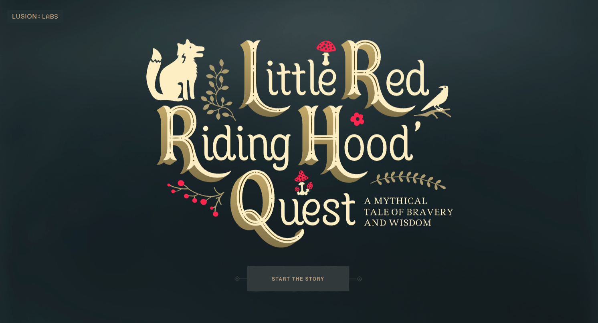
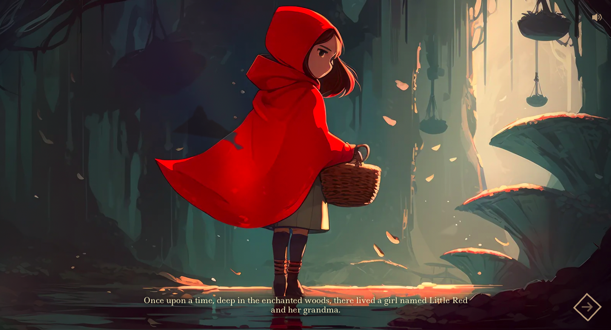

# Horry Story Experience

A horror story experience created with Rive and Vite.
This project is about a person working in an digital agency.
When he come back inside the office, he find out that the office is haunted.
The player can explore the office and try to find a way to escape.

## Inspiration

This project is inspired by [The Little red hood quest](https://ai-quest.lusion.co/) made by [Lusion](https://lusion.co/).
A studio created by [Edan Kwan](https://x.com/edankwan).
You can see all the labs project on [Lusion's labs website](https://labs.lusion.co/).

See the case study on Medium [here](https://medium.com/@PaulineStich/case-study-little-red-riding-hood-8abc7dd3738d).

## Tech Stack

- [Rive](https://rive.app/)
- [Vite](https://vite.dev/)
- [GSAP](https://greensock.com/gsap/)

## IA used

- [ChatGPT](https://chat.openai.com/) For the story
- [ElevenLabs](https://elevenlabs.io/) For the narration
- [Midjourney](https://midjourney.com/) For the assets
- [Suno](https://suno.ai/) For the AI music

[See it live](https://horror-experience.netlify.app/)

This project is still in development.

## TODO

- [ ] Create the UX/UI for the "Start scene"
- [ ] Change the narration for an English version
- [ ] Finish the entrance scene
